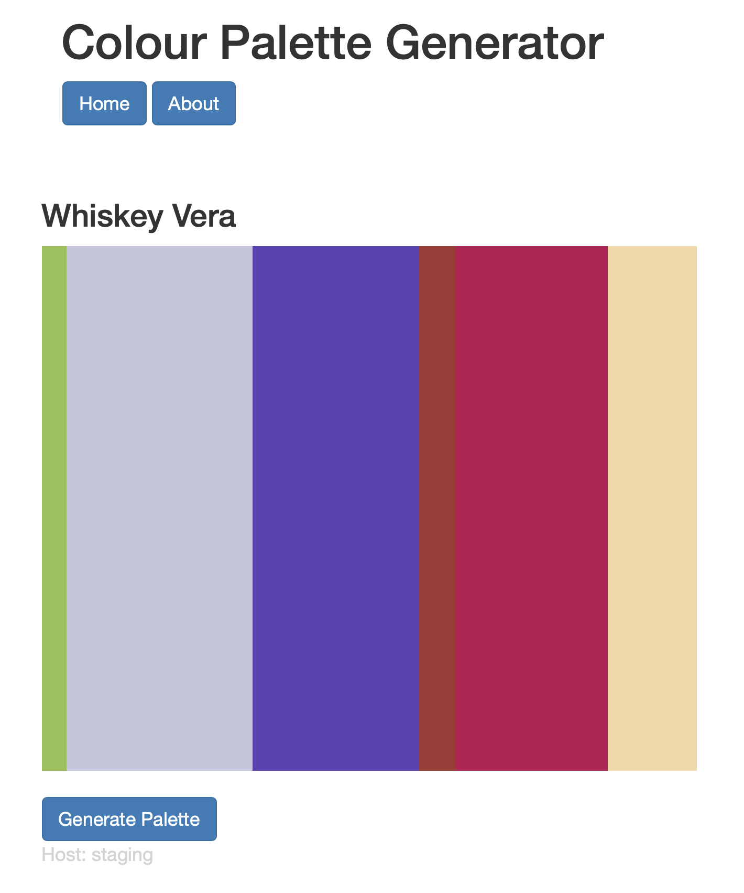

# Colour Palette Generator – Milestone Project

**Scenario:** both you and your trainer are part of a development team for this *Palette Generator* application. The trainer is the developer for the application and you are the DevOps engineer.

Your task is to create a CI/CD pipeline with *Jenkins* that will allow your trainer to push up new changes to the repository and see the application running, without the trainer having to make any further configurations.

You are expected to create a Freestyle job to do the following:

* Clone down the contents of the repository.
* Run unit tests.
* Run the application.

To start working on this project, use this repository as a template to create a version under your own username. You are welcome to make changes to the source code as you wish.

<details>
   
<summary>Click here to view the stretch goals</summary>
   
   * Publish the unit test and coverage reports using plugins.
   * Create two jobs that are triggered separately for the `main` and `development` branches:
       * Pushes to `development` should trigger the unit tests and publish the results.

       * Pushes to `main` should trigger the application to start as a systemd service.

   * Configure Jenkins to notify developers when a job has been completed. This could be via email, a Teams message, a Slack message, etc.

The stretch goals for this project are optional, but you are heavily encouraged to implement them!
   
</details>

## Guidance

Below are the instructions for getting the app running. They should aid you in creating the pipeline.

### Installation (Ubuntu)

Python, pip and venv must all be installed:

```bash
sudo apt-get update
sudo apt-get install -y python3 python3-pip python3-venv
```

Create and activate the virtual environment:

```bash
python3 -m venv venv
source venv/bin/activate
```

Install pip requirements:

```bash
pip3 install -r requirements.txt
```

### Testing 

To run tests and retrieve coverage:

```bash
python3 -m pytest --cov=application --cov-report=term-missing
```

To generate `JUnit` and `Cobertura` coverage reports:

```bash
python3 -m pytest --cov=application --junitxml=junit.xml --cov-report=xml --cov-report=term-missing
```

### Running the App

To run the application on the command line, simply run:

```bash
python3 app.py
```

The app will be accessible via your machine's IP address on port 5000. After you click the `Generate Palette` button, you should see a colour scheme and its name displayed on the page like so:



The app will look for an environment variable named `HOSTNAME` and display its value at the bottom of the webpage. On Ubuntu machines, this variable is set to be the name of the host by default.

If you wish to set your own custom `HOSTNAME`, you can export the variable like so:

```bash
export HOSTNAME="Servy McServerface"
```

A script has been provided that will start the application running as a *daemon* process. It can be run with the command:

```bash
./scripts/deploy.sh
```

This will start the *daemon* service running as a `systemd` process named `palette-generator`. You can check the status of the application by running:

```bash
sudo systemctl status palette-generator
```

If the app is running correctly, you should see a response similar to this:

```
● palette-generator.service - Palette Generator
     Loaded: loaded (/etc/systemd/system/palette-generator.service; disabled; vendor preset: enabled)
     Active: active (running) since Wed 2021-07-28 13:33:35 UTC; 2s ago
   Main PID: 38028 (bash)
      Tasks: 6 (limit: 2367)
     Memory: 74.2M
     CGroup: /system.slice/palette-generator.service
     ...
```
